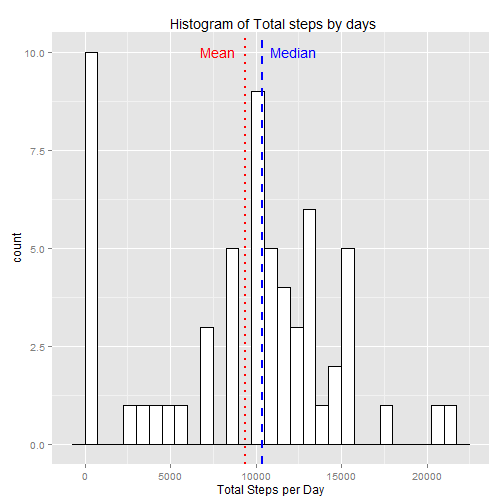
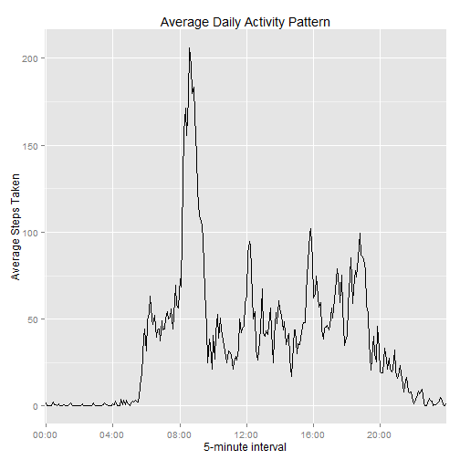
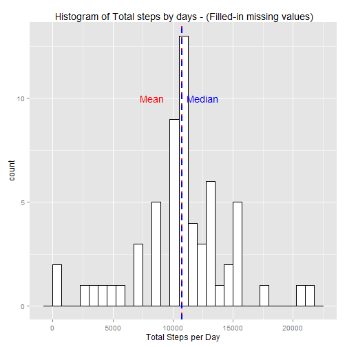

## Loading and preprocessing the data

1. Load the data

   File downloaded and extracted on October-12-14, 1:01:58 PM from
   https://d396qusza40orc.cloudfront.net/repdata%2Fdata%2Factivity.zip

```r
## verify existence of files in the working directory
fileActivity <- "activity.csv"
if(!file.exists(fileActivity)){
        stop(paste("Required file does not exist:",
                   fileActivity), call.= FALSE)
}
# Read the file
activity <- read.csv(fileActivity, sep=",", header=TRUE, as.is = TRUE)
```
2. Process/Transform the data into a format suitable for the analysis

```r
# Function to convert interval into more readable time format "%H:%M"
library(stringr)
toTime <- function(s){
        len = str_length(s)
        r = NA
        ifelse(len == 1,r <- paste0("00:0",s),s)
        ifelse(len == 2,r <- paste0("00:",s),s)
        ifelse(len == 3,r <- paste0("0",substr(s,1,1),":",substr(s,2,3)),s)
        ifelse(len == 4,r <- paste0(substr(s,1,2),":",substr(s,3,4)),s)
        
        return(r)
        
}
# create a new variable called time
library(plyr)
activity <-ddply(activity, "interval", transform, time = toTime(interval))
# calculate average by day
activityByDay <- ddply(activity, "date", summarize,
                       sumsteps = sum(steps, na.rm = TRUE))
```

## What is mean total number of steps taken per day?

1. Make a histogram of the total number of steps taken each day


```r
library(ggplot2)

p <- ggplot(activityByDay, aes(x=sumsteps)) + 
        geom_histogram(binwidth=750, colour="black", fill="white")

p <- p + geom_vline(aes(xintercept=mean(sumsteps, na.rm=T)),   
                   color="red", linetype="dotted", size=1)
p <- p + geom_vline(aes(xintercept=median(sumsteps, na.rm=T)),   
                    color="blue", linetype="dashed", size=1)
p <- p + annotate("text", x = 7800, y = 10, color = "red", label = "Mean")
p <- p + annotate("text", x = 12200, y = 10, color = "blue", label = "Median")
p <- p + ggtitle(" Histogram of Total steps by days")

print(p)
```

 

2.  Calculate and report the mean and median total number of steps taken per day


```r
mean(activityByDay$sumsteps, na.rm = TRUE)
```

```
## [1] 9354.23
```

```r
median(activityByDay$sumsteps, na.rm = TRUE)
```

```
## [1] 10395
```
## What is the average daily activity pattern?

1. Make a time series plot( i.e. type = "l") of the 5-minute interval(x-axis)
   and the aveage number of steps taken, averaged across all days (y-axis)
   

```r
# average by interval
activityByInt <-ddply(activity, "time", summarize,
                      avg = mean(steps, na.rm = TRUE))

timebreaks <- c("00:00", "04:00", "08:00", "12:00", "16:00", "20:00")

p <- ggplot(data=activityByInt, aes(x=time, y=avg, group = 1)) + geom_line()
p <- p + ylab("Average Steps Taken" ) + scale_x_discrete(breaks = timebreaks)
p <- p + ggtitle("Average Daily Activity Pattern")
print(p)
```

 

2. Which 5-minute interval, on average across all the days in the dataset, contains the
   maximum number of steps?
   

```r
activityByInt[activityByInt$avg == max(activityByInt$avg), ]
```

```
##      time      avg
## 104 08:35 206.1698
```

## Imputing missing values

1. Calculate and report the total number of missing values in the dataset


```r
nrow(activity[is.na(activity$steps),])
```

```
## [1] 2304
```

2. The strategy for filling in all of the missing values in the dataset consists
   in using the mean by intervals to replace the NA values on steps column.
   
3. Create a new dataset that is equal to the original datase but with the
   missing data filled in.
   

```r
fact <- activity
fact <- ddply(fact, "time", mutate, steps = replace(steps, is.na(steps),
                                                    mean(steps, na.rm=TRUE)))
```

4. Make a histogram of the total number of steps taken each day and calculate
   and report the mean and median total number of steps taken per day.


```r
activityByDay <- ddply(fact, "date", summarize,
                       sumsteps = sum(steps))


p <- ggplot(activityByDay, aes(x=sumsteps)) + 
        geom_histogram(binwidth=750, colour="black", fill="white")

p <- p + geom_vline(aes(xintercept=mean(sumsteps, na.rm=T)),   
                    color="red", linetype="dotted", size=1)
p <- p + geom_vline(aes(xintercept=median(sumsteps, na.rm=T)),   
                    color="blue", linetype="dashed", size=1)
p <-p + annotate("text", x = 8300, y = 10, color = "red", label = "Mean")
p <-p + annotate("text", x = 12500, y = 10, color = "blue", label = "Median")
p <- p + ggtitle(" Histogram of Total steps by days - (Filled-in missing values)")

print(p)
```

 

```r
mean(activityByDay$sumsteps)
```

```
## [1] 10766.19
```

```r
median(activityByDay$sumsteps)
```

```
## [1] 10766.19
```

Both the median and the mean are higher than the estimates from the first part of the assignment. The histogram shows the frequency became steeper around the mean and the value for the mean is equal to the one of the median.

## Are there differences in activity patterns between weekdays and weekends?

1. Create a new factor variable in the dataset with two levels - "weekday" and
   "weekend" indicating whether a given date is a weekday or weekend
   

```r
fact <- ddply(fact, "date", transform,
              dayType = ifelse(as.POSIXlt(as.Date(date))$wday %in% c(0,6),
                               "weekend", "weekday"))
```

2. Make a panel plot containing a time series plot (type = "l") of the 5-minute interval(x-axis)
   an the average number of steps taken, averaged across all weekday days or weekend days (y-axis).
   

```r
activityByTyp <-ddply(fact, c("dayType", "time"), summarize,
                      avg = mean(steps, na.rm = TRUE))                                                    
p <- ggplot(data=activityByTyp, aes(x=time, y=avg, group = 1)) + geom_line()
p <- p + facet_wrap( ~ dayType, ncol = 1)
p <- p + ylab("Average Steps Taken" ) + scale_x_discrete(breaks = timebreaks)
p <- p + ggtitle("Average Daily Activity Pattern")
print(p)
```

 
